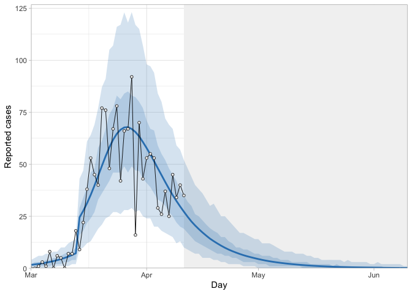

<!-- README.md is generated from README.Rmd. Please edit that file -->

### Quantifying the impact of COVID-19 control measures using a Bayesian model of physical distancing

This repository contains code associated with a manuscript investigating
the impact of COVID-19 control measures in British Columbia, Canada. Here is the preprint: https://www.medrxiv.org/content/10.1101/2020.04.17.20070086v1. 

The main statistical model written in [Stan](https://mc-stan.org/) is
available [here](analysis/seeiqr.stan) and the main R function that
calls this model for a vector of daily case counts is available
[here](analysis/fit_seeiqr.R). A function to make projection plots is
available [here](analysis/make_projection_plot.R). 

A more fully featured and documented version of this model, which can accommodate multiple types of case data at once (e.g., reported cases, hospitalizations, ICU admissions) and estimate segments of positive-case sampling fractions for reported cases, is also available as an R package [covidseir](https://github.com/seananderson/covidseir).

Generally, any part of the analysis can be re-created by running one of
the numbered R files starting with `01-...R` in the
[`analysis`](analysis) folder. Alternatively, the file
[`00-run-all.R`](analysis/00-run-all.R) can be sourced to run the entire
analysis.

You will need the following packages installed:

``` r
install.packages(c("tidyverse", "remotes", "rstan", "here", 
  "future", "deSolve", "furrr", "cowplot", "reshape2"))
remotes::install_github("seananderson/ggsidekick")
```

An example of how to run the model:

``` r
library("rstan")
library("dplyr")
library("ggplot2")
rstan_options(auto_write = TRUE) # cache the compiled model
options(mc.cores = parallel::detectCores() / 2) # Stan parallel processing
seeiqr_model <- rstan::stan_model("analysis/seeiqr.stan")
source("analysis/fit_seeiqr.R")
source("analysis/make_projection_plot.R")

d <- readr::read_csv("data-generated/daily-cases.csv")
d
#> # A tibble: 42 x 2
#>    date       cases
#>    <date>     <dbl>
#>  1 2020-03-01     0
#>  2 2020-03-02     0
#>  3 2020-03-03     1
#>  4 2020-03-04     3
#>  5 2020-03-05     1
#>  6 2020-03-06     8
#>  7 2020-03-07     0
#>  8 2020-03-08     6
#>  9 2020-03-09     5
#> 10 2020-03-10     0
#> # … with 32 more rows
```

``` r
# Using fewer iterations for a quick example:
fit <- fit_seeiqr(d$cases, seeiqr_model = seeiqr_model,
  iter = 300, chains = 4)
```

``` r
print(fit$fit, pars = c("R0", "f2", "phi"))
#> Inference for Stan model: seeiqr.
#> 4 chains, each with iter=300; warmup=150; thin=1; 
#> post-warmup draws per chain=150, total post-warmup draws=600.
#> 
#>        mean se_mean   sd 2.5%  25%  50%  75% 97.5% n_eff Rhat
#> R0     2.95    0.00 0.04 2.88 2.93 2.95 2.97  3.02   373    1
#> f2     0.22    0.00 0.07 0.07 0.17 0.22 0.27  0.35   284    1
#> phi[1] 6.87    0.12 2.38 3.11 5.19 6.41 8.34 12.53   389    1
#> 
#> Samples were drawn using NUTS(diag_e) at Thu Apr 16 20:20:05 2020.
#> For each parameter, n_eff is a crude measure of effective sample size,
#> and Rhat is the potential scale reduction factor on split chains (at 
#> convergence, Rhat=1).
```

``` r
make_projection_plot(list(fit)) + theme_light()
```


